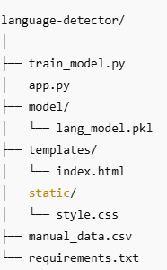
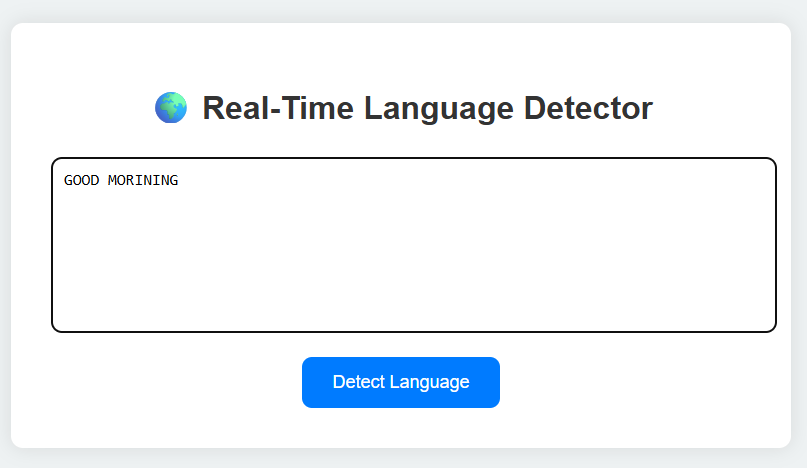
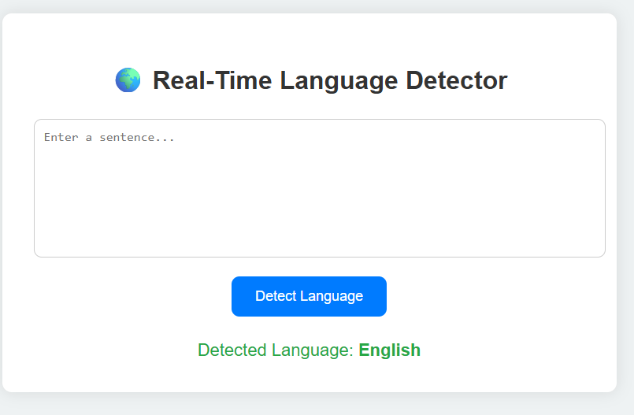

# Real-Time Language Detector — Flask + Naive Bayes

A simple web application that detects the language of a given sentence using a Naive Bayes classifier trained on a manually created dataset.
The app is built with Python, Flask, and scikit-learn, and features a clean, responsive UI.

## Features
- Manual dataset with multilingual examples.

- Naive Bayes classifier for text classification.

- Flask web interface for easy interaction.

- Clean and modern HTML/CSS design.

- Fully customizable — add more languages and examples for better accuracy.

## Project Structure

## Installation & Setup
1. Clone the repository

git clone https://github.com/your-username/language-detector.git
cd language-detector

2. Create a virtual environment and install dependencies

python -m venv venv
### On macOS / Linux
source venv/bin/activate
### On Windows
venv\Scripts\activate
pip install -r requirements.txt

3. Prepare the dataset

Edit manual_data.csv to add or update text-language pairs:

text,language
"Hello, how are you?",English
"Hola, ¿cómo estás?",Spanish
"Bonjour, comment allez-vous?",French
"こんにちは",Japanese
"안녕하세요",Korean
"Привет, как дела?",Russian

4. Train the model

python train_model.py

This will:

Read manual_data.csv

Train a Naive Bayes model

Save the model to model/lang_model.pkl

5. Run the application

python app.py

6. Open in browser

Visit:

http://127.0.0.1:5000/

## How It Works

Dataset: Sentences in multiple languages stored in manual_data.csv.

## Model Training:

Uses CountVectorizer to convert text into numerical features.

Trains a MultinomialNB (Naive Bayes) classifier.

## Web Interface:

Users enter a sentence.

The trained model predicts its language in real time.

## Customization

- Add more languages and examples in manual_data.csv.

- Adjust model type (e.g., SVM, Logistic Regression) in train_model.py.

- Improve UI design in static/style.css.

## Requirements

- Python 3.8+

- Flask

- pandas

- scikit-learn

## Install with:

pip install -r requirements.txt

## INPUT

## OUTPUT

